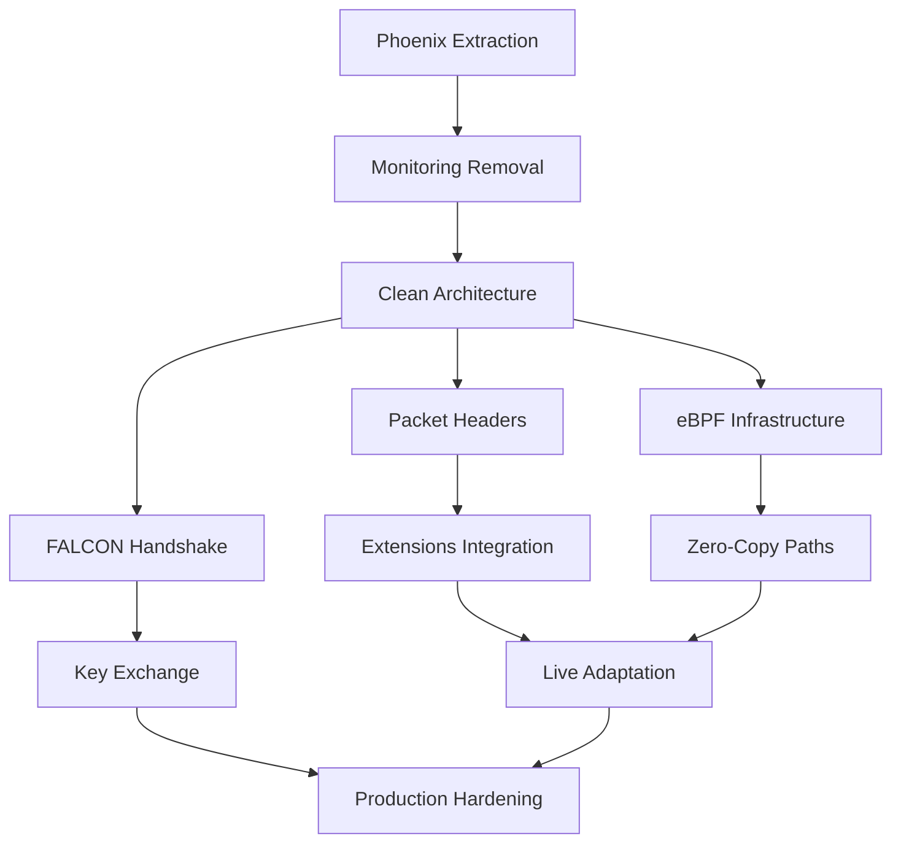

# STOQ Implementation Priority Matrix
## Execution Guide for 100% Completion

**Purpose**: Define clear priorities and dependencies for parallel execution
**Method**: Impact vs Effort analysis with dependency mapping
**Timeline**: 12-month execution plan with parallel streams

---

## Priority Classification

### P0 - Critical Path (Must Complete First)
These items block all other work and must be completed sequentially.

| Task | Impact | Effort | Duration | Dependency | Agent |
|------|--------|--------|----------|------------|-------|
| Phoenix SDK Extraction | 10/10 | 3/10 | 2 weeks | None | ops-developer |
| Monitoring Removal | 9/10 | 2/10 | 1 week | Phoenix done | ops-developer |
| Clean Architecture Validation | 10/10 | 2/10 | 1 week | Monitoring done | ops-qa |

**Rationale**: Cannot proceed with protocol work until contamination removed

### P1 - High Priority (Core Protocol)
Essential protocol features that define STOQ's value proposition.

| Task | Impact | Effort | Duration | Dependency | Agent |
|------|--------|--------|----------|------------|-------|
| Packet Header Design | 10/10 | 5/10 | 2 weeks | Clean arch | ops-integration |
| Extension Integration | 9/10 | 7/10 | 4 weeks | Headers done | ops-developer |
| FALCON Handshake | 10/10 | 8/10 | 4 weeks | Clean arch | ops-developer |
| eBPF Infrastructure | 9/10 | 9/10 | 4 weeks | Clean arch | system-admin |

**Rationale**: Core differentiators that make STOQ unique

### P2 - Medium Priority (Performance)
Performance optimizations that achieve target metrics.

| Task | Impact | Effort | Duration | Dependency | Agent |
|------|--------|--------|----------|------------|-------|
| Zero-Copy Paths | 8/10 | 6/10 | 2 weeks | eBPF ready | ops-developer |
| Live Adaptation | 7/10 | 7/10 | 3 weeks | Extensions done | ops-developer |
| Connection Pooling | 6/10 | 4/10 | 1 week | Clean arch | ops-developer |
| Frame Batching | 7/10 | 5/10 | 2 weeks | eBPF ready | ops-developer |

**Rationale**: Performance features that enable 10+ Gbps target

### P3 - Lower Priority (Polish)
Production readiness and quality improvements.

| Task | Impact | Effort | Duration | Dependency | Agent |
|------|--------|--------|----------|------------|-------|
| Security Audit | 8/10 | 3/10 | 2 weeks | All features | ops-qa |
| Documentation | 6/10 | 4/10 | 2 weeks | All features | ops-developer |
| Compatibility Testing | 7/10 | 5/10 | 2 weeks | All features | ops-qa |
| Performance Validation | 8/10 | 4/10 | 2 weeks | All features | ops-qa |

**Rationale**: Required for production but not for functionality

---

## Parallel Execution Streams

### Stream A: Architecture & Cleanup
**Owner**: ops-developer (primary)
**Duration**: Months 1-2
**Dependencies**: None (can start immediately)

```
Week 1-2: Phoenix Extraction
Week 3:   Monitoring Removal
Week 4:   Performance Monitor Cleanup
Week 5-6: Regression Detector Removal
Week 7-8: Architecture Validation
```

### Stream B: Protocol Extensions
**Owner**: ops-integration + ops-developer
**Duration**: Months 3-4
**Dependencies**: Stream A complete

```
Week 9-10:  Packet Header Design
Week 11-12: Tokenization Integration
Week 13-14: Sharding Protocol
Week 15-16: Multi-hop Routing
```

### Stream C: Quantum Cryptography
**Owner**: ops-developer (dedicated)
**Duration**: Months 5-6
**Dependencies**: Stream A complete (can parallel with B)

```
Week 17-18: QUIC Handshake Analysis
Week 19-20: Key Exchange Protocol
Week 21-22: Signature Integration
Week 23-24: Fallback Mechanisms
```

### Stream D: Performance Layer
**Owner**: system-admin + ops-developer
**Duration**: Months 7-8
**Dependencies**: Stream A complete (can start early)

```
Week 25-26: eBPF Infrastructure
Week 27-28: Zero-Copy Implementation
Week 29-30: Packet Processing
Week 31-32: Performance Tuning
```

---

## Dependency Graph



---

## Resource Allocation Matrix

### Developer Allocation by Phase

| Phase | ops-developer | ops-integration | ops-qa | system-admin |
|-------|--------------|-----------------|--------|--------------|
| Phase 1 | 100% | 0% | 20% | 0% |
| Phase 2 | 70% | 100% | 10% | 0% |
| Phase 3 | 100% | 50% | 20% | 0% |
| Phase 4 | 50% | 0% | 10% | 100% |
| Phase 5 | 80% | 20% | 30% | 20% |
| Phase 6 | 30% | 10% | 100% | 10% |

### Optimal Team Size
- **Minimum**: 2 developers (sequential execution, 18 months)
- **Recommended**: 4 developers (parallel streams, 12 months)
- **Maximum**: 6 developers (aggressive parallel, 8 months)

---

## Quick Start Execution Plan

### Week 1 Actions
```bash
# Day 1-2: Phoenix Extraction Planning
- Analyze Phoenix dependencies
- Design extraction strategy
- Create migration plan

# Day 3-4: Begin Extraction
- Create HyperMesh SDK module
- Move Phoenix interfaces
- Update imports

# Day 5: Testing
- Validate STOQ functions without Phoenix
- Run regression tests
- Document changes
```

### Week 2 Actions
```bash
# Day 1-2: Complete Phoenix Migration
- Finish code movement
- Update all references
- Clean up remnants

# Day 3-4: Start Monitoring Extraction
- Identify monitoring code
- Design minimal metrics
- Begin extraction

# Day 5: Validation
- Test clean transport
- Verify no contamination
- Prepare for next phase
```

---

## Risk-Adjusted Timeline

### Best Case (All Goes Well)
- Phase 1: 6 weeks (vs 8 planned)
- Phase 2: 7 weeks (vs 8 planned)
- Phase 3: 7 weeks (vs 8 planned)
- Phase 4: 7 weeks (vs 8 planned)
- Phase 5: 7 weeks (vs 8 planned)
- Phase 6: 6 weeks (vs 8 planned)
- **Total**: 10 months

### Realistic Case (Some Delays)
- Phase 1: 8 weeks (as planned)
- Phase 2: 8 weeks (as planned)
- Phase 3: 9 weeks (+1 week)
- Phase 4: 10 weeks (+2 weeks)
- Phase 5: 9 weeks (+1 week)
- Phase 6: 8 weeks (as planned)
- **Total**: 13 months

### Worst Case (Major Issues)
- Phase 1: 10 weeks (+2 weeks)
- Phase 2: 10 weeks (+2 weeks)
- Phase 3: 12 weeks (+4 weeks)
- Phase 4: 14 weeks (+6 weeks)
- Phase 5: 12 weeks (+4 weeks)
- Phase 6: 10 weeks (+2 weeks)
- **Total**: 17 months

---

## Success Criteria Checklist

### Phase 1 Complete When:
- [ ] Phoenix SDK completely removed
- [ ] Monitoring extracted to HyperMesh
- [ ] Performance monitor cleaned
- [ ] Regression detector removed
- [ ] Zero application logic in transport

### Phase 2 Complete When:
- [ ] Packet headers designed and implemented
- [ ] Tokenization in actual packets
- [ ] Sharding protocol operational
- [ ] Multi-hop routing functional
- [ ] All extensions packet-level

### Phase 3 Complete When:
- [ ] FALCON in QUIC handshake
- [ ] Key exchange operational
- [ ] Signatures integrated
- [ ] Fallback mechanisms working
- [ ] Quantum resistance active

### Phase 4 Complete When:
- [ ] eBPF programs loaded
- [ ] Zero-copy paths operational
- [ ] Packet processing accelerated
- [ ] 10+ Gbps achieved
- [ ] Kernel bypass working

### Phase 5 Complete When:
- [ ] Live parameter updates working
- [ ] Network tiers detected accurately
- [ ] Dynamic optimization active
- [ ] Stability mechanisms operational
- [ ] Adaptation proven effective

### Phase 6 Complete When:
- [ ] Security audit passed
- [ ] Performance validated at scale
- [ ] Compatibility verified
- [ ] Documentation complete
- [ ] Production packages ready

---

## Immediate Next Steps

### For ops-developer:
1. Start Phoenix extraction TODAY
2. Create migration branch
3. Begin code movement
4. Set up testing framework

### For ops-integration:
1. Research QUIC extension mechanisms
2. Design packet header format
3. Prepare for Phase 2 start

### For ops-qa:
1. Create validation test suite
2. Define clean architecture criteria
3. Prepare security testing framework

### For system-admin:
1. Research eBPF requirements
2. Set up kernel dev environment
3. Prepare performance lab

---

## Communication Framework

### Daily Standups
- Stream A: 9:00 AM
- Stream B: 9:30 AM
- Stream C: 10:00 AM
- Stream D: 10:30 AM

### Weekly Sync
- Monday: Priority review
- Wednesday: Technical deep-dive
- Friday: Progress assessment

### Phase Gates
- End of each phase: Go/No-go decision
- Criteria must be met to proceed
- Executive review required

---

**Execution Begins**: Immediately with Phoenix extraction
**First Milestone**: Clean architecture (Week 8)
**Critical Path**: Architecture → Extensions → FALCON
**Success Metric**: 100% pure protocol by Month 12